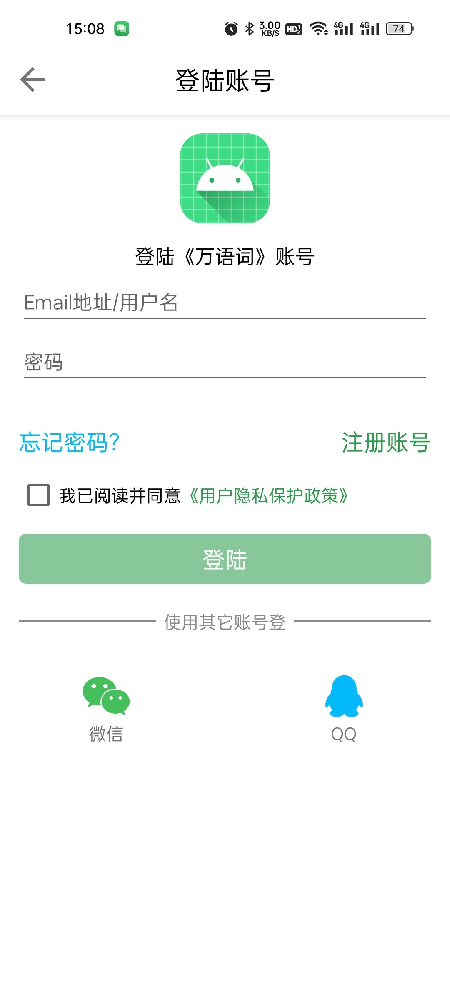
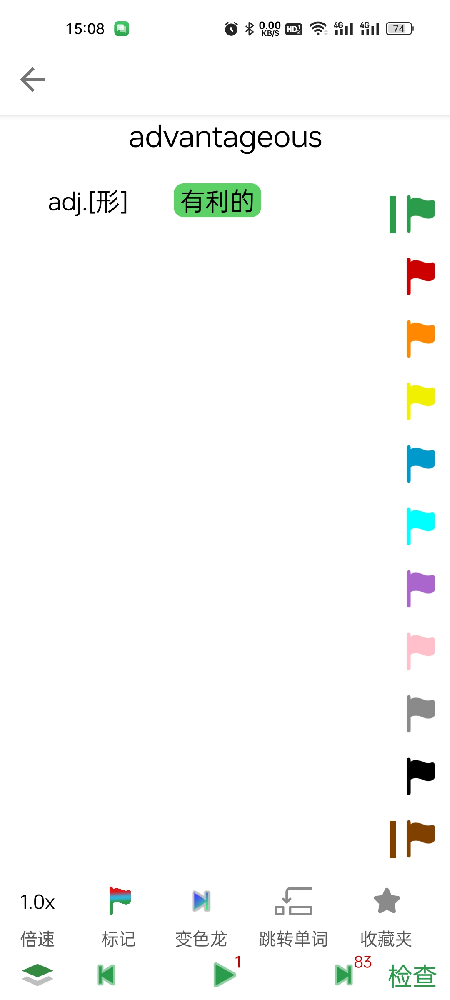
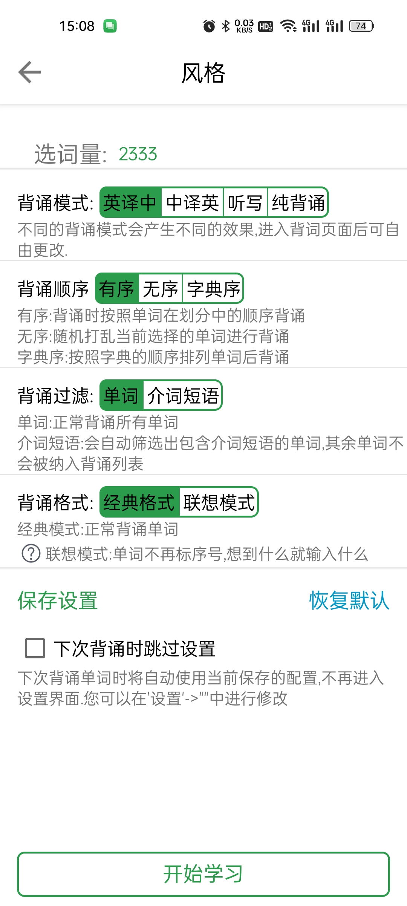
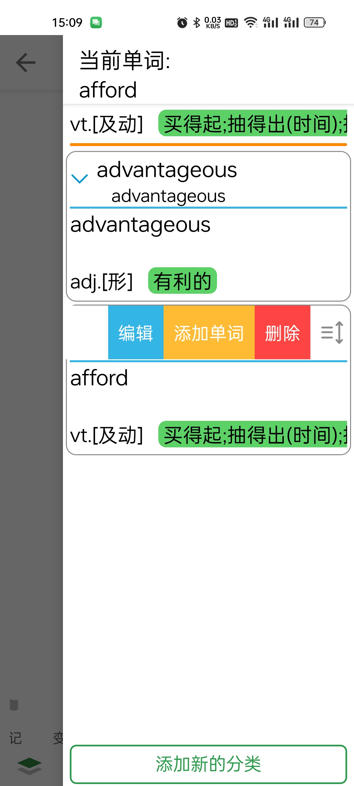
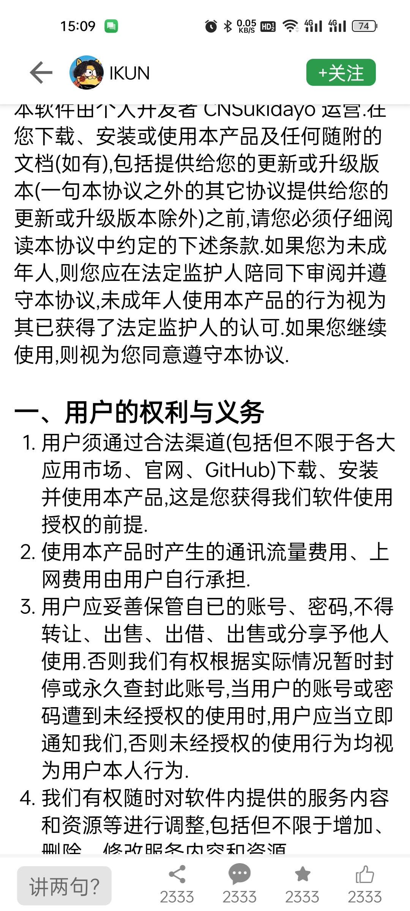

# WWord

### 介绍

万语词,正如其名它致力于提供一套统一的逻辑完成任意语言词汇的学习.
引入独创的单词标记技术方便用户更好地对遗忘知识进行查漏补缺,
用户可以在该平台发布Markdown格式的帖子分享语言学习中的各种心得.
项目基于SpringBoot+Mybatis实现,采用Docker容器化部署.
包含管理员模块、权限模块、核心功能模块、搜索模块等.

### 软件架构

### 模块划分

* 注册中心:nacos
* 网关gateway:Gateway 聚合所有的接口,统一接受处理前端的请求;并且在转发前异步调用权限模块进行鉴权.
* 公共模块:将所有服务模块需要的功能单独抽离(包括全局异常响应和异常处理,过滤器).
* 实体类模块:通过拆分为前端、公共、后端三个部分的实体类模块,使得系统各层之间相互独立解耦.
* 鉴权模块:用户注册、获取用户信息、判断用户是否有目标接口权限、角色管理、角色分配接口权限等.
* 核心模块:包括用户收藏夹功能管理、markdown帖子管理
* 管理员模块:单词划分管理、导入单词管理
* 搜索模块:ElasticSearch单词搜索、更新ES列表

### 界面展示

<table border="0px">
    <tr>
        
        
    </tr>    
    <tr>
        
        
    </tr>
    <tr>
        <td colspan="2" style="text-align: center;width: 50%">
             </img>
        </td>
    </tr>
</table>